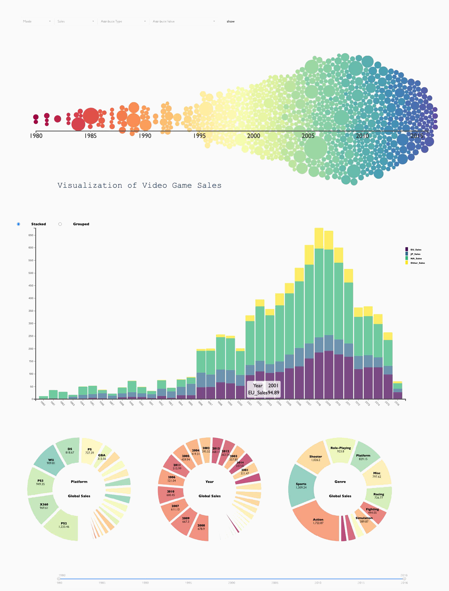

# 电子游戏数据分析

25th Jan 2021

——by [@pkuccr](https://github.com/pkuccr), [@jiaqi-xi](https://github.com/jiaqi-xi), [@Git-JK](https://github.com/Git-JK), [@Akanesasu](https://github.com/Akanesasu)

## 运行方法

1. 安装node.js和anywhere，教程见https://www.jianshu.com/p/3f0b7ea9df53
2. 打开cmd，在vgvis文件夹下执行命令anywhere

## 数据简介

电子游戏销量数据来自[vgchartz.com](https://www.vgchartz.com/) 网站。其每条游戏数据包括如下字段：

- **Rank**：游戏销量排名；
- **Name**：游戏名；
- **Platform**：游戏发行平台；
- **Year**：发行年份；
- **Genre**：游戏种类；
- **Publisher**： 游戏发行商；
- **NA_Sales, EU_Sales, JP_Sales, Global_Sales**：分别表示游戏至数据收集时在北美、欧洲、日本、全世界其他各地的销量（百万美元）。

## 效果展示

